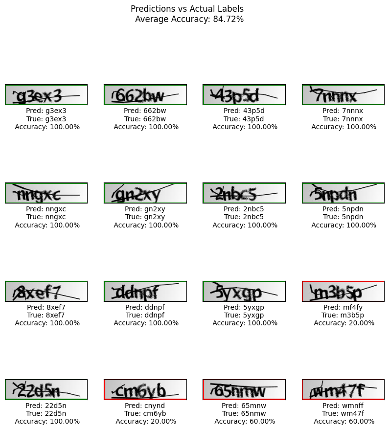
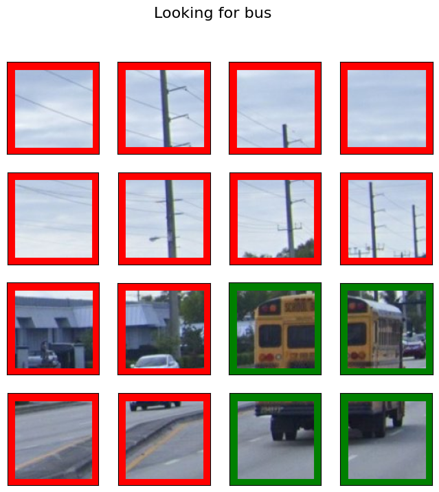
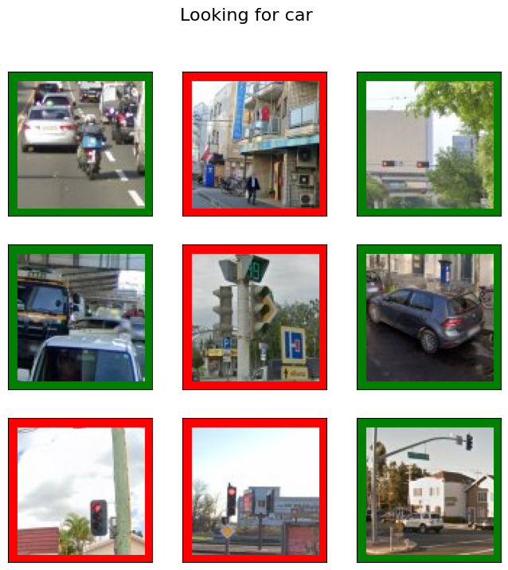
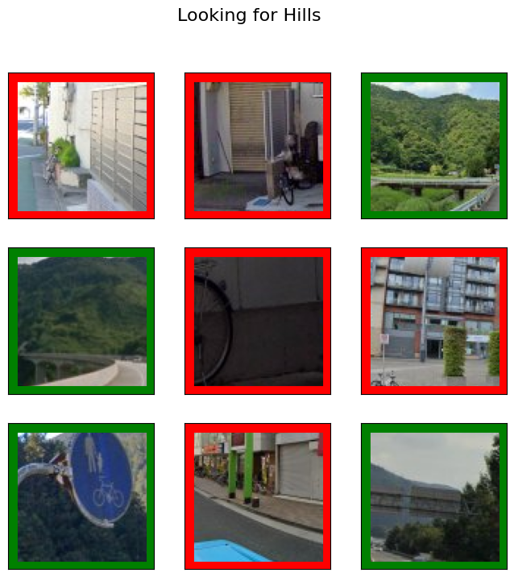
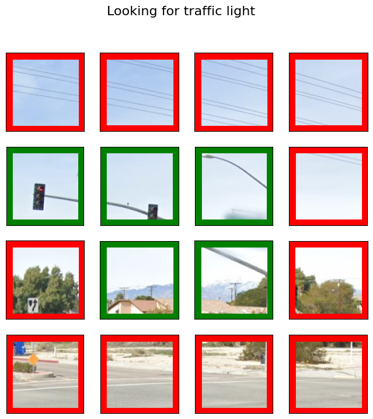
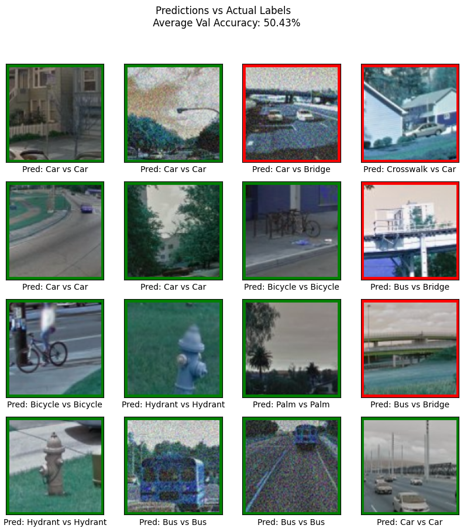

# CAPTCHA_ML
## Models

### Alphanumeric CAPTCHAs
- `letter_captchas.ipynb` classifies CAPTCHAs composed of letters and numbers. 
- Example:
  
  

### Google reCAPTCHAs
- `recaptcha.ipynb` classifies Google reCAPTCHAs composed of images of real-world objects.
- Uses a pre-trained image segmentation model trained on the MIT image segmentation dataset with over 150 classes.
- Is able to solve 3x3 captchas composed of multiple images, of 4x4 captchas where one image is broken down into a grid.
- 

- Examples:
    - 
    - 
    - 
    - 

### Image CAPTCHAs (outdated)
- `image_captchas.ipynb` classifies CAPTCHAs that are images of objects in real life. 
- This was our first attempt at classifying images of real-world objects.
- Has low accuracy (hovering around 50%).
- Has a limited number of classes in our dataset: https://www.kaggle.com/datasets/mikhailma/test-dataset
- 
  
### CAPTCHA Classifier
- `captcha_type.ipynb` classifies if a CAPTCHA is alphanumeric, 3x3 reCAPTCHA (non-segmented images), or 4x4 reCAPTCHA (one segmented image).

### Complete Pipeline
- `main.ipynb` combines our previous models to classify any of the 3 types of CAPTCHAs.

## Helpers

### Web Scraper
- `scrape.ipynb` scrapes the Google reCAPTCHA demo to get hundreds of images of CAPTCHAs used by Google. These images are labeled by what the CAPTCHA is asking the user to look for.

### CAPTCHA Generator
- `gen_captcha.ipynb` uses the images in the Kaggle dataset of image-based CAPTCHAs to generate 3x3 CAPTCHA images that can be used for training. Web scraping gives us better data, but given our large existing dataset, this is a fast way to get CAPTCHAs without scraping the web.

## Data Sources
- Alphanumeric CAPTCHAs from Kaggle: https://www.kaggle.com/datasets/fournierp/captcha-version-2-images
- Google reCAPTCHA dataset of image-based CAPTCHAs from Kaggle: https://www.kaggle.com/datasets/mikhailma/test-dataset
- Google reCAPTCHA demo for CAPTCHA images used in the real world: https://www.google.com/recaptcha/api2/demo
  

  
## Model Credits
- Pre-trained image segmentation [model](https://github.com/CSAILVision/semantic-segmentation-pytorch) trained on the MIT image segmentation datatset with over 150 classes
- Weights for the pre-trained model http://sceneparsing.csail.mit.edu/model/pytorch/ade20k-resnet50dilated-ppm_deepsup/
- References for pre trained model
  - Semantic Understanding of Scenes through ADE20K Dataset. B. Zhou, H. Zhao, X. Puig, T. Xiao, S. Fidler, A. Barriuso and A. Torralba. International Journal on Computer Vision (IJCV), 2018. (https://arxiv.org/pdf/1608.05442.pdf)
  - Scene Parsing through ADE20K Dataset. B. Zhou, H. Zhao, X. Puig, S. Fidler, A. Barriuso and A. Torralba. Computer Vision and Pattern Recognition (CVPR), 2017. (http://people.csail.mit.edu/bzhou/publication/scene-parse-camera-ready.pdf)
- Inspiration for model design of Alphanumeric CAPTCHA classifier https://github.com/DrMahdiRezaei/Deep-CAPTCHA/blob/master/Captcha_Solver_numerical.ipynb

# Usage
- Download all the required libraries using ```pip install -r requirements.txt```
- Install [tensorflow](https://www.tensorflow.org/install)

# To Do
- We need to expand the number of classes since the MIT ADE20K Dataset does not include all classnames that a CAPTCHA might have
- We need to be able to translate between reCAPTCHA prompts and classes in our dataset
  - For example the prompt might say "mountains or hills" but our model needs prompt like "mountain"
  - This could be done in the following way:
    - If it's a one word prompt like "buses" we can singularize it to "bus". This can be done with the `inflect` library
    - It it's multiple words like "mountains or hill" we can split along the conncetive word "or" and make the words singular
    - For some words like "traffic light" we need manually add them to the dataset
      - The class names file might have a row like ```137,0.0003,528,65,0,traffic;light;traffic;signal;stoplight``` and we can add 'traffic light' to the list
- If we add new original classes that don't have a synonymous word for in our dataset, like 'crosswalk' we will need to train on new labeled images. Since our data collection method (web scraping) does not come with ground truth labels we have to manually label data.
- We can fill in the gaps in our MIT ADE20K segmentation model, with another pre-trained model from Hugging Face to avoid the manual data labeling task.
  